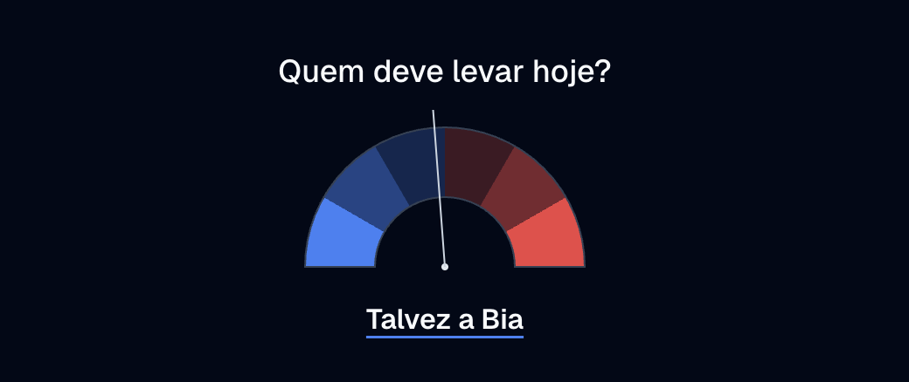
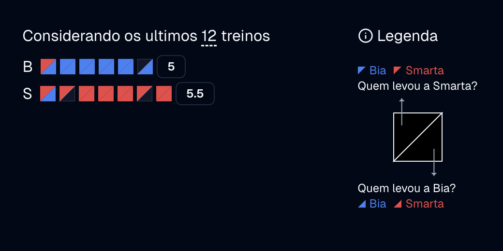
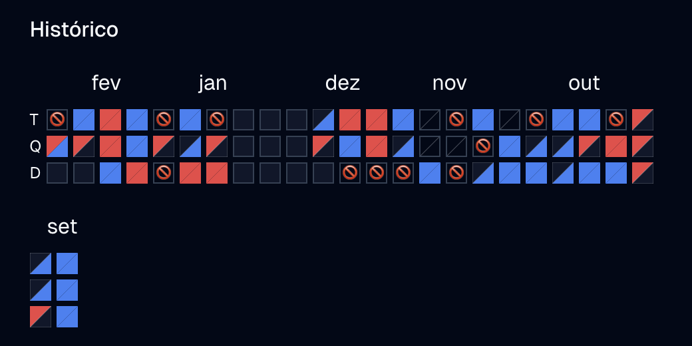

# Reveza

A tool for balancing out carpool driving duties over time. Specifically made for two friends who give each other rides to roller derby practices.

## Features

The gauge shows the recommended driver for the next practice. The gauge is calculated based on the number of practices each person has driven to in the past, and shows how balanced the driving duties have been. The more it leans to one side, the stronger the recommendation that that person should drive next.

The unit chart per driver summarizes the driving duties over the last few number of practices, this number can be adjusted through a slider. The number at the end of each bar shows the contribution score of each person during that period. The contribution score is calculated as 1 point for each ride given and 0.5 for each time the person drove to practice but didn't give a ride.

  

Finally, at the bottom of the page, the full history of driving duties is shown.

 

## Description

This is a [Next.js](https://nextjs.org) project bootstrapped with [`create-next-app`](https://nextjs.org/docs/app/api-reference/cli/create-next-app).

Data is hosted on [Baserow](https://baserow.io/).

Uses:

- [Tailwind CSS](https://tailwindcss.com/) for styling.
- [shadcn/ui](https://ui.shadcn.com/) for UI components.
- [d3](https://d3js.org/) for calculating arcs.
- [date-fns](https://date-fns.org/) for date manipulation.
